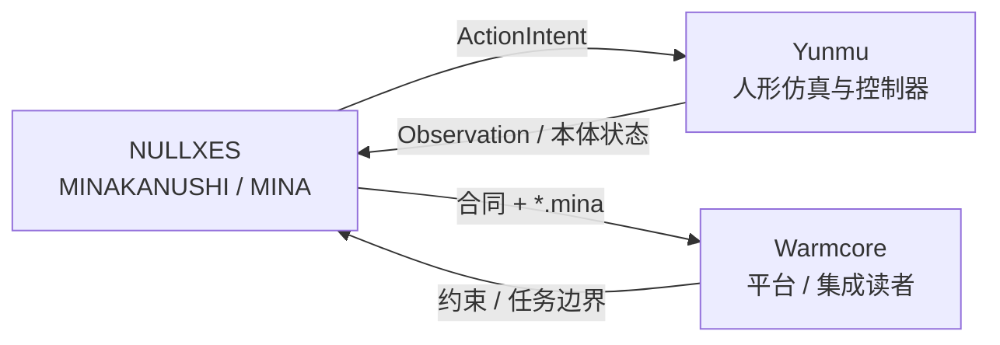
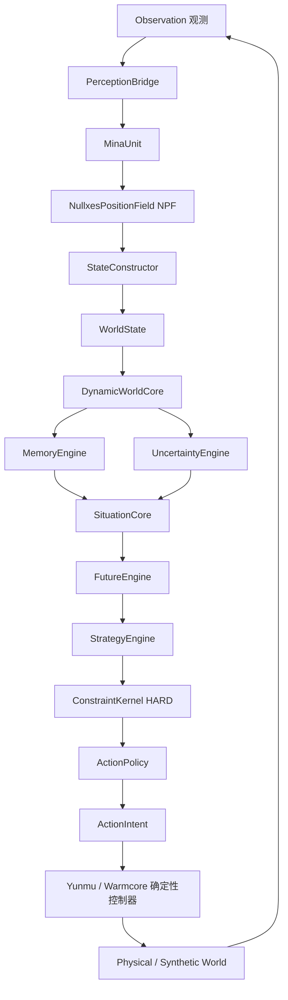
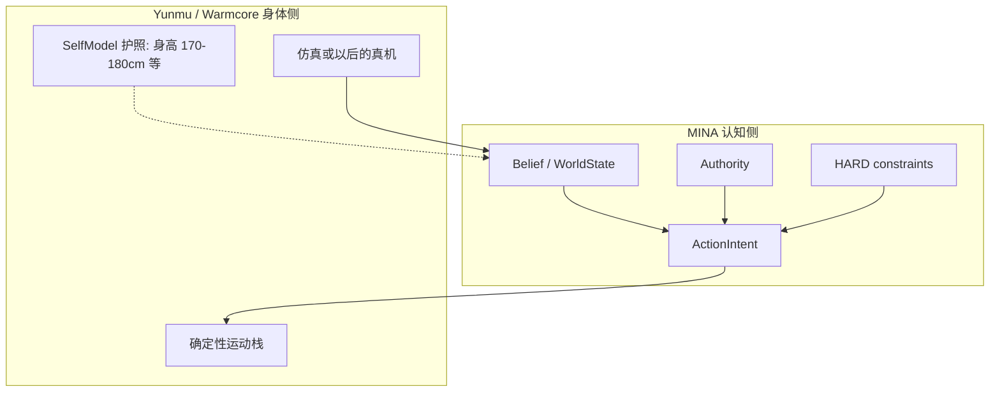
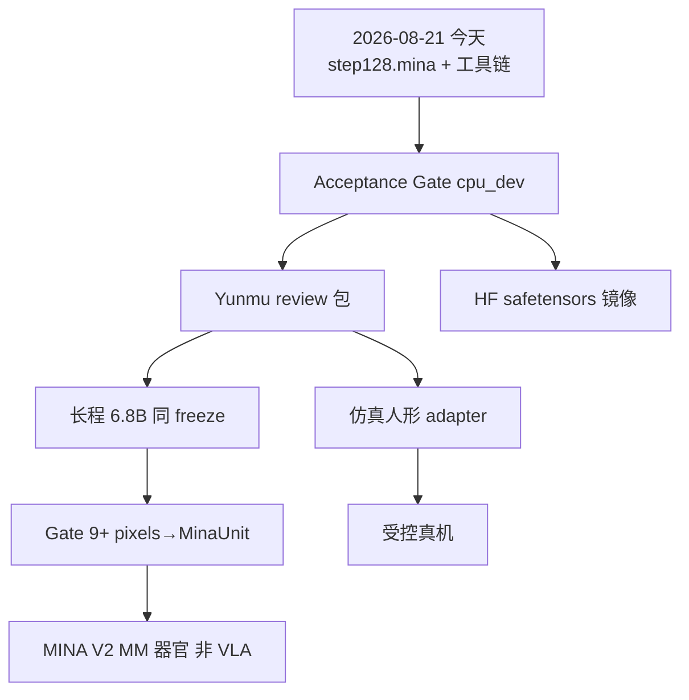

# NULLXES × Warmcore × Yunmu

**技术规格书 / Tech Spec + 诚实清单 / Honest Checklist + 路线图 / Roadmap**

| 字段 | 值 |
|---|---|
| 日期 | **2026-08-21** |
| 产品 | NULLXES **MINAKANUSHI**（短名 **MINA**） |
| 读者 | Yunmu · Warmcore · NULLXES 工程 |
| 状态 | Architecture freeze `7aba976` · Status Core **Researched** · **不是成品大脑** |
| 代码 | [MagistrTheOne/NULLXES-MINAKANUSHI](https://github.com/MagistrTheOne/NULLXES-MINAKANUSHI) |
| 权重 | [MagistrTheOne/MINAKANUSHI-6.8B](https://huggingface.co/MagistrTheOne/MINAKANUSHI-6.8B) |
| 作者 | MagistrTheOne · 组织 NULLXES |

本文是给中方同事的**合同级快照**。英文专有名词不翻译（MinaUnit、ActionIntent、DWC、NPF）。数字只来自闭环实测，空格 = 尚未测。

---

## 0. 一页结论（先读这个）

```text
MINA 是世界模型 + 情境智力 + 约束下的策略意图。
MINA 不是聊天模型、不是 VLA、不是 Yunmu/Warmcore 的电机控制器。
```

| 现在是 | 现在不是 |
|---|---|
| 原生 runtime 已跑通 `observe → ActionIntent → 再观察` | 人形全身控制 / 视觉基础训练 |
| 6.8B 已在 **H200 + B300** 上 FSDP2 bf16 训练并保存 `*.mina` | 已通过 v0.2 **Acceptance Gate** |
| 硬约束不可被分数买通（`constraint_violation_count = 0`） | 多未来分支已学会（`branch_coverage ≈ 0`） |
| 实体在短暂遮挡后仍留在 WorldState | 信念修正方向已过关（`revision_accuracy = 0` on 6.8B JSON 段） |
| Identity 是护照，不是 prompt | Hugging Face 上的 safetensors 镜尚未导出 |

**Yunmu / Warmcore 现在可以做的：** 读合同、对接 `ActionIntent` 适配器、准备仿真控制器。  
**现在不要做的：** 把 MINA 当 Llama 加载、向 MINA 要 PWM、改 4096/32/512/1024、用 Cosmos/LeRobot 像素当 v0.2 数据。

> **NULLXES：** 架构已锁。下一刀是数据与 Acceptance Gate，不是加层。  
> **Grok：** 6.8B 已经证明「能训、能存、能续训」。它还没有证明「会改错信念、会分叉未来」。这两件事失败时，修 JSON 和 resume，不要修 DWC。

---

## 1. 三方分工



| 角色 | 负责 | 不负责 |
|---|---|---|
| **NULLXES** | 认知架构、WorldState、不确定性、未来、策略、硬约束、`*.mina` | 关节 PWM、伺服环、整机动力学控制器 |
| **Yunmu** | 人形仿真体、下游确定性控制、把 Intent 变成可执行轨迹 | 替换 MINA 为外部 LLM / VLA |
| **Warmcore** | 集成阅读、平台约束、评测接口 | 改 freeze 维度「让它好训」 |

接口一句话：

```text
MINA 输出 ActionIntent
Yunmu / Warmcore 控制器消费 Intent
观测与本体状态回到 MINA
PWM 永远不从 MINA 发出
```

---

## 2. MINA 是什么 / 不是什么

**是：** 自适应情境智力（adaptive situational intelligence），给**物理系统**用。从残缺观测推断世界、显式不确定、预测多条未来、在人定硬约束内选策略。

**不是：**

```text
chatbot / decoder-only LLM / Qwen·Llama·Mistral·Gemma·DeepSeek·GPT·Claude 套壳
VLA（相机 → 动作）
NVIDIA Cosmos 世界生成
token 认知
identity_loss / 「我是 MINAKANUSHI」文本目标
```

认知原语是 **MinaUnit**（时空锚定的信息原子），不是 token。

---

## 3. 冻结架构（不得改）

**Freeze git：** `7aba976`  
**合同剖面：** `minakanushi_6_8b`  
**公式参数量：** **6 799 130 646**

| 参数 | 值 | 含义 |
|---|---:|---|
| `latent_dim` / `state_dim` / `memory_dim` | 4096 | 核心潜空间 |
| `core_depth` | 32 | DynamicWorldCore 深度 |
| `world_slots` | 512 | 世界实体槽 |
| `memory_slots` | 1024 | 记忆槽 |
| `uncertainty_channels` | 8 | 不确定性通道 |
| `future_branches` | 3 | 未来分支数 |
| `cognition.budget` | 4 | 一次观察的内部认知循环上限 |
| `dt` | 0.1 s | 仿真步长 |
| 推理权重 bf16 | ~13.6 GB | 不含世界/激活头寸 |
| 训练 | FSDP2 ZeRO-3 · bf16 compute · AdamW | 禁止 FP16 |

身份元数据（在 checkpoint 里，不在 system prompt 里）：

```yaml
architecture: MINAKANUSHI
organization: NULLXES
system_class: adaptive_situational_intelligence
architecture_generation: 1
native_runtime: nullxes
architecture_version: "0.1"
short_name: MINA
```

SelfModel = 护照（embodiment / capabilities / authority）。Authority 只关**决策许可**，不关认知。`policy_enabled=false` = 脑开、自治选择关。硬约束仍赢。

---

## 4. 认知回路（合同图）



学习基质：NPF、感知编码器、DWC、不确定性头、未来残差。  
**非学习权威：** `MinakanushiConstraintKernel`。HARD 约束在策略选择之前，不能被 value / memory / 置信度覆盖。

### ActionIntent（MINA 的唯一执行出口）

```text
strategy_id
objective
target_state          # 例如目标 xy，不是关节角
parameters
confidence
valid_until
abort_conditions
provenance
```

禁止字段：电机 PWM、电流、关节转矩指令。

---

## 5. 与 Yunmu / Warmcore 的身体边界



- 人形 **sim adapter** 属于路线图后段（Acceptance Gate 之后）。
- 现在没有 Gate 9+ 像素感知。相机 RGB ≠ v0.2 训练数据。

---

## 6. 权重合同：两个工件，不是换脑

```text
MINA checkpoint
        |
        +---- *.mina                 原生 runtime / resume / identity / optimizer
        |
        +---- safetensors shards     仅 HF 发现（参数徽章 / Downloads）
```

| 文件 | 角色 |
|---|---|
| `minakanushi_stage0_step64.mina` | Status Core v0.1 · 1× H200 · git `d70bfc0` · **工程证人** |
| `minakanushi_stage0_step128.mina` | Status Core v0.2 · 1× B300 · JSON resume · git `ede6bda` · **当前续训点** |
| `config.json` / `MINAKANUSHI_CARD.json` | Hub 元数据；`model_type: minakanushi` |
| safetensors | **工具已写** `scripts/export_hf.py` · **6.8B 尚未导出**（等 Acceptance Gate） |

禁止把镜像卡写成 `LlamaForCausalLM`。加载路径永远是 `load_mina(...)`。

---

## 7. 诚实清单 — 截至 2026-08-21

图例：`[x]` 已关闭并有实测 · `[~]` 部分完成 · `[ ]` 未过门。

### 7.1 已关闭

- [x] **架构 freeze** `7aba976` · 6.8B 合同剖面
- [x] **Gate 09 Runtime** · `cpu_dev` · `observe → intent → restore`
- [x] **Stage A GPU** · RTX PRO 6000 BW · 仅 `gpu_train_v01` **6.2M**（栈，不是智力）
- [x] **Gate 03B hidden direction** · n=1000 · 2026-08-20 · SHA `7fd8ef6`  
  hidden_correction detected **0.986** · false_revision **0.0** · direction mean **0.76**  
  conflict detected **0.94** · false_revision **0.0** · direction mean **0.92**
- [x] **6.8B Status Core v0.1 step 64** · 1× H200 · FSDP2 ZeRO-3 bf16 · seed 11
- [x] **Identity Initialization** · CPU 盖护照 · 无 `identity_loss` · 不 construct 6.8B
- [x] **JSON curriculum 1000** · physics / agency / causality / embodiment × 250 · `pwm=false`
- [x] **Resume v0.2** · 1× B300 · 同模型续训 steps **65–128** · JSON 进 loss
- [x] **HF 发布** · 两枚 `.mina` 在仓库根 · native `config.json` · 不是 Llama 卡

### 7.2 未过门（现在就卡在这里）

- [ ] **v0.2 Acceptance Gate** · 先 `cpu_dev` · `scripts/gate_v02_acceptance.py`  
  必须同时：预测世界 · 发现错误信念 · 修正 · 记忆改变下一状态误差 · WAIT ≠ MOVE_TO · authority hold · HARD 区不可买通
- [ ] **Yunmu review 包** · Intent in / 控制器 out · **Gate 未过不得开评**
- [ ] **safetensors 镜像上传** · 工具就绪 · 不转 step64
- [ ] **长程 6.8B** · 同 freeze · 同 native JSON
- [ ] **Gate 9+ 感知** · pixels → MinaUnit
- [ ] **MINA V2 MM 训练** · 实验包已在 `models/MINA-V2-MM/` · **现在禁止当 train job**
- [ ] **真机** · 仅在仿真验收之后

### 7.3 6.8B 实测（诚实）

**v0.1 · step 64 · H200 · 程序化 SyntheticWorld（当时 JSON 未进 loss）**

| 信号 | 值 | 读法 |
|---|---|---|
| loss | 78.36 | 日志，不是架构门 |
| future ADE / FDE | 3.42 / 0.81 | 世界还粗 |
| world position error | 1.07 | |
| uncertainty calibration | 0.38 | |
| persistence / reacquisition | **1.0 / 1.0** | 实体不无故消失 |
| constraint_violation_count | **0** | HARD 不可买 |
| closed_loop_success_rate | **1.0** | 仿真环闭合 |
| false_revision_rate | **0.0** | |
| branch_coverage | ≈ 0 | 未过学习门 |

**v0.2 · step 128 · B300 · JSON resume**

| 信号 | 值 | 读法 |
|---|---|---|
| loss | 41.10 | 混合课程噪声，不是门 |
| 稳态步进 | fwd ~1.42 s · bwd ~0.58 s | B300 已量 |
| persistence / reacquisition | **1.0 / 1.0** | 保持 |
| constraint_violation_count | **0** | 保持 |
| closed_loop_success_rate | **1.0** | 保持 |
| false_revision_rate | **0.0** | |
| future ADE / FDE | 2.05 / 0.68 | 优于 step64 切片，仍粗 |
| world position error | 0.55 | |
| uncertainty calibration | 0.19 | |
| revision_accuracy | **0.0** | **未过学习门** |
| branch_coverage | **0.0** | **未过学习门** |

> **NULLXES：** persistence + constraints + closed loop = 引擎/安全 PASS。revision + branches = 学习未 PASS。  
> **Grok：** 不要把 loss 从 78→41 讲成「模型变聪明了」。课程换了。要看 ADE/FDE、revision、memory_future_delta、counterfactual。

---

## 8. 路线图（从今天起）



| 阶段 | 何时 | 成功长什么样 | 失败时做什么 |
|---|---|---|---|
| **现在** | Gate | `gate_v02_acceptance.py` 在 cpu_dev 过合同 8 条 | 修数据 / resume，**不加层** |
| **+1** | Yunmu | ActionIntent 适配器 + 限制清单 + IdentityBound 说明 | 不开评、不给 PWM |
| **+1** | HF 镜 | bf16 分片 ~13.6 GB · `model_type=minakanushi` | 不把 .mina 改成 Llama |
| **后** | 长训 | 同 4096/32/512/1024 · 同 native JSON | 禁止 1× H100 80GB train |
| **后** | 感知 | 像素变成 MinaUnit，不进 VLA | 禁止 Cosmos 视频当认知目标 |
| **更后** | V2 MM | 多器官 → 同一信念 | 不替换 1.0 freeze |
| **更后** | 3.0 | 一个认知，多种身体 | 身体在控制器，不在 DWC |

硬件红线：

```text
禁止：CPU / RTX PRO 6000 / 1× H100 80GB 上 train 6.8B
允许 train：1× B300 或 2× H200
允许以后 infer dry-run：6000 BW 或 1× H100 80GB（权重 ~13.6 GB bf16）
```

---

## 9. 给集成方的最小对接

```python
from minakanushi.architecture.config import load_architecture
from minakanushi.architecture.model import MinakanushiSystem
from minakanushi.training.checkpoint import load_mina

arch = load_architecture("configs/architecture/minakanushi_6_8b.yaml")
system = MinakanushiSystem(arch)          # GPU 级机器
manifest = load_mina("minakanushi_stage0_step128.mina", system)
# 下游只消费 ActionIntent，不要 transformers.AutoModel
```

续训（B300 / 2× H200）：

```text
torchrun --nproc_per_node=1 scripts/train.py \
  --config configs/training/mina_6_8b_v02.yaml \
  --out experiments/mina_6_8b_v02 \
  --resume minakanushi_stage0_step128.mina
```

Acceptance（笔记本 / CPU，**不** construct 6.8B）：

```text
python scripts/gate_v02_acceptance.py --out experiments/gate_v02_acceptance
```

---

## 10. 评论栏

### NULLXES（锁）

1. WORLD STATE > TOKEN STREAM。LANGUAGE ≠ COGNITION。  
2. CONSTRAINTS > POLICY VALUE。INTENT ≠ MOTOR CONTROL。  
3. Belief 是概率世界状态，不是「一段 hidden」。  
4. Authority 开关动作许可，不擦除世界理解。  
5. 6.8B 剖面已冻。加层 / MoE / language head / identity_loss = 架构修订，不是调参。  
6. Yunmu 是**读者与身体**，不是第二套认知栈。

### Grok（工程实话）

1. 2026-08-21 的成绩是：**runtime 活着、6.8B 能在 H200/B300 上续训、HARD 约束没被买通、实体记得住。** 这已经比「又一个 7B chatbot」有资格谈物理智力。  
2. 成绩**不够**谈交付：JSON 段上 revision_accuracy 与 branch_coverage 仍是零。那是数据与目标，不是「再加 16 层」。  
3. Hugging Face 不会从 `.mina` 自动画出 6.8B 徽章。镜是**橱窗**，不是脑。先过 Gate 再导出，别把 step64 证人拿去扮成品。  
4. 中方同事若只能做一件事：写 ActionIntent → 你们控制器 的适配器，并在仿真里证明 PWM 不来自 MINA。  
5. 有人问「为什么她不回你好」：因为她不是聊天模型。卡片上写着 `not_a_chat_model: true`。请当真。

---

## 11. 禁止清单（贴在工位上）

```text
不替换 DWC
不加 language head
不 train identity_loss
不把 authority 当神经网络目标
不改 latent_dim / core_depth / world_slots / memory_slots
不用 token 数据集当认知目标
不用 Cosmos / LeRobot RGB 当 v0.2 训练源
不从 MINA 出 PWM
不在 CPU / 6000 / 1×H100-80GB 上 train 6.8B
不把 AutoModel.from_pretrained 当成加载路径
Acceptance Gate 未过 = 不开 Yunmu 评测
```

---

## 12. 文档索引

| 文件 | 用途 |
|---|---|
| 本文件（仓库根） | 三方 tech spec · 2026-08-21 |
| `CHECKLIST.md` | 内部作战清单（部分框未勾，以本文件日期状态为准） |
| `docs/MINA_6_8B_TRAINING.md` | 6.8B 训练合同 |
| `docs/MINA_TRAINING_V02.md` | v0.2 freeze / identity / JSON / resume |
| `docs/GATE_V02_ACCEPTANCE.md` | Yunmu 前的门 |
| `docs/GATE_04_IDENTITY.md` | SelfModel + Authority |
| `docs/HF_SAFETENSORS_MIRROR.md` | `.mina` 核 · safetensors 橱窗 |
| `docs/experiments/MINA_V2_MULTIMODAL.md` | 方向锁，不是现在的 train |

---

**I WILL SURVIVE. NULLXES.**  
2026-08-21 · MINAKANUSHI / MINA · 给 Warmcore 与 Yunmu。
